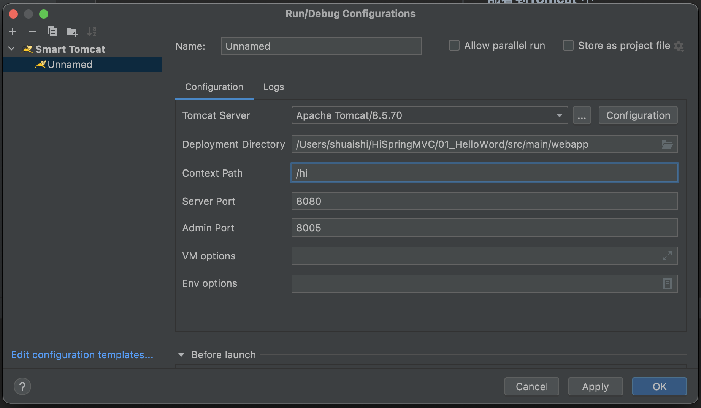

## 一 Spring MVC入门

### 创建项目
+ 控制器
+ Spring-mvc.xml
+ Web.xml
+ Hello.jsp

### 部署到Tomcat 中


### 浏览器请求
+ curl http://localhost:8080/hi/hello.do

### 处理器请求过程
#### 简化过程
+ 客户端发送请求 —-> 到达tomcat —-> tomcat发现是请求是*.do的请求 —-> tomcat 将请求转发给中央调度器DispatcherServlet —-> 中央调度器根据url将转发给我们自定义的controller —-> DispacherServlet根据controller的返回结果做跳转操作 —-> 将结果输出到客户端

#### 详细过程
+ 1、tomcat启动的时候，会初始化DispatcherServlet，DispatcherServlet中会创建一个springmvc容器，其实就是我们熟悉的spring容器（ApplicationContext），只不过这个容器的类型是（WebApplicationContext），此容器会加载web.xml中contextConfigLocation指定的springmvc配置文件

+ 2、由于spring-mvc.xml中指定了扫描包的规则，而HelloController符合这个扫描规则，所以会被注册到springmvc容器中

+ 3、当发起*.do请求的时候，请求会到达DispatcherServlet中央处理器，中央处理器会根据请求路径，去springmvc容器中找到能够处理这个请求的方法，具体由哪个方法来处理这个请求呢？
  + 这里就是通过@RequestMapping来匹配的，这个注解可以将请求和方法进行映射，匹配的请求会被@RequestMapping标注的方法处理，所以在这个步骤中springmvc容器会发现HelloController这个bean的hello方法方法可以处理/hello.do请求

+ 4、DispatcherServlet中通过反射来调用helloController这个bean的hello方法

+ 5、DispatcherServlet接收到了hello方法的返回值

+ 6、DispatcherServlet根据hello方法的返回值，做跳转操作，相当于  request.getRequestDispatcher("/WEB-INF/view/hello.jsp").forward(request,response);
6.2、简化过程

客户端发送请求 —-> 到达tomcat —-> tomcat发现是请求是*.do的请求 —-> tomcat 将请求转发给中央调度器DispatcherServlet —-> 中央调度器根据url将转发给我们自定义的controller —-> DispacherServlet根据controller的返回结果做跳转操作 —-> 将结果输出到客户端


## 几个注解
```text
@Controller用法
@RequestMapping 用在方法上
@RequestMapping 用在类上
@RequestMapping 6种规则详解
http请求头中的Content-Type是干什么的？
http请求头中的Accept是干什么的？
@PostMapping、@GetMapping、@DeleteMapping、@PutMapping
```

+ @Controller
  + 用来标注在类上，表示这个类是一个控制器类，可以用来处理http请求，通常会和@RequestMapping一起使用。
+ @RequestMapping
  + 表示请求映射，一般用在我们自定义的Controller类上或者Controller内部的方法上。 
  + 通过这个注解指定配置一些规则，满足这些规则的请求会被标注了@RequestMapping的方法处理。

+ 当springmvc容器启动时，会扫描标注有@Controller注解的类，将这些Controller中标注有@RequestMapping的方法收集起来，得到一个Map<@RequestMapping,Method>（@RequestMapping和方法的映射），当一个请求到达DispatcherServlet的时候，其内部会根据请求的信息（url、参数、header、请求的类型【通过头中的Content-type指定】、可以接受的类型【可以通过头中的Accept指定】）去这个Map中和@RequestMapping中的规则进行匹配，从而得到可以处理这个请求的方法，然后进行调用，所有的@RequestMapping都匹配失败的时候，会返回404

+ 匹配规则
  + 通过value、path来限制请求地址 

|url的值	|说明|
|  ----  | ----  |
|{“/user/insert”}	|可以处理/user/insert这个请求|
|{“/user/list”,”/user/getList”}	|可以同时处理/user/list和/user/getList这2个请求|

  + 通过header属性来限制请求头 

|header的值	|说明|
 |  ----  | ----  |
  |  {“header1”}	|请求的header中必须有header1这个头，值随意|
|   {“header1=v1”}|	必须包含header1为v1的头|
|   {“!header1}	|这里用到了!符号，表示头中不能有header1这个头|
|   {“header1”,“header2=v2”}|	header的值是and关系，所以这个值表示：头中必须包含header1以及header2，且header2的值为v2  |

  + 通过params属性来限制请求参数

|params的值	|说明|
|  ----  | ----  |
|{“name”}|	请求中必须包含name参数，值随意|
|{“name=路人”}	|请求中必须包含name这个参数，且值必须是路人|
|{“name”,”age=1”}|	请求中必须包含参数name和参数age，且age的值为1|
|{“!age”}	|请求中不能有参数age|
  + 通过method属性来限制http请求额方法

|method的值|	说明|
|  ----  | ----  |
|{POST}	|只能接受post请求|
|{POST,GET}	|post、get请求都可以处理|

  + 通过consumes属性来限制请求的类型

|consumes的值|说明|
|  ----  | ----  |
|{“application/x-www-form-urlencoded”}|请求中Content-Type的类型必须是application/x-www-form-urlencoded类型|
|{“application/*”}|Content-Type的类型必须是application类型的，比如：application/json、application/pdf、application/x-www-form-urlencoded|
|{“image/gif”, “image/png”}|Content-Type的可以是[“image/gif”, “image/png”]中的任意一种|

  + 通过produces属性来限制客户端可以接受的类型
  
  |  produces的值   | 说明  |
  |  ----  | ----  |
  |{“application/json”}|服务器端支持返回application/json类型数据，所以要求Accept也可以接受这种类型的数据|
  |{“image/gif”, “image/png”}|服务器端支持返回[“image/gif”, “image/png”]中其中一种类型数据，所以要求Accept也可以接受这2中种类型中任意一种就可以|
	
    	
    	

